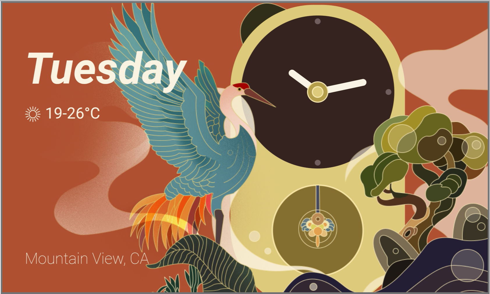
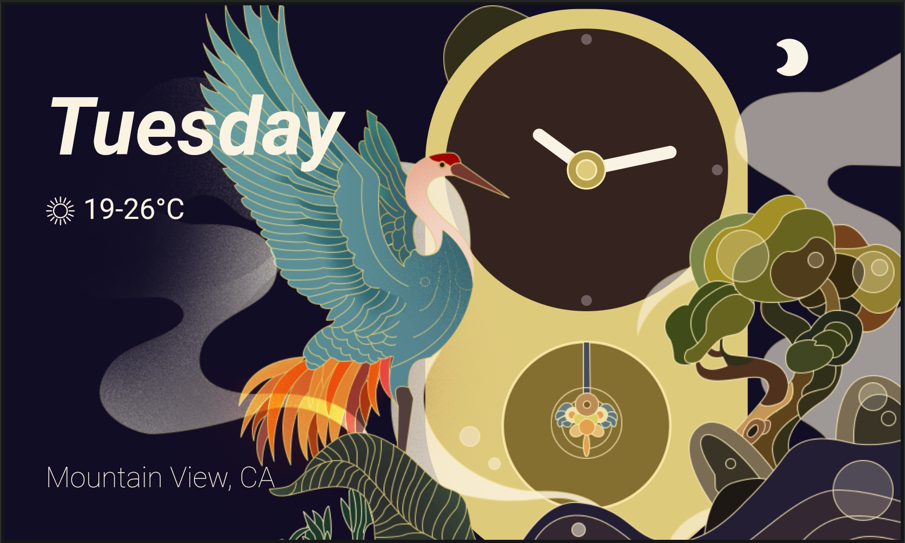
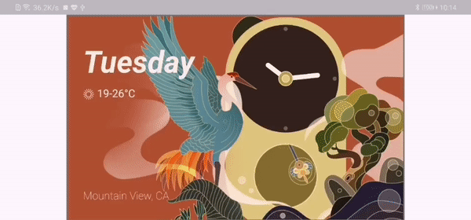

# chan_clock(禅)

This clock was created for submission to the [flutter clock challenge](https://flutter.dev/clock).

## Screenshots

### Light Theme



### Dark Theme



### Demo



## How to run

```
flutter channel stable
flutter upgrade
cd chan_clock
flutter create .
flutter run (on Android, iOS in landscape)
```
